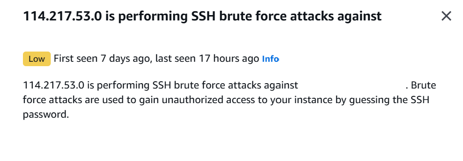
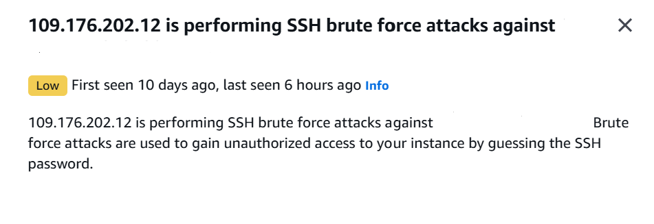
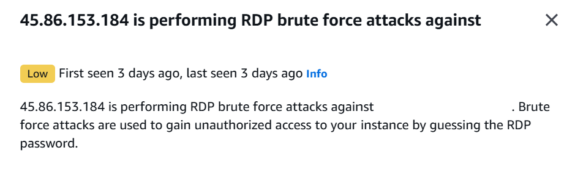
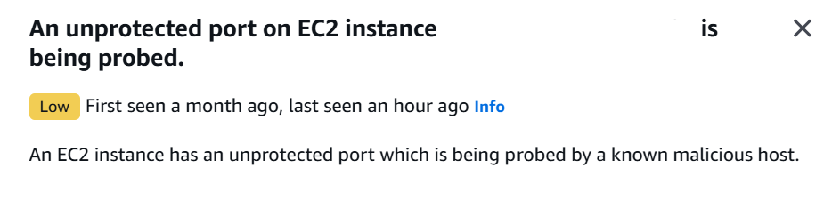
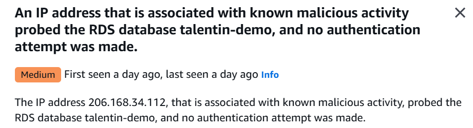

# Cloud Security Monitoring – AWS GuardDuty

## Overview
AWS GuardDuty was enabled to monitor cloud activity
related to the application during the assessment period.

GuardDuty analyzes AWS CloudTrail, VPC Flow Logs,
and DNS logs to identify suspicious behavior.

---

## GuardDuty Finding Summary

**Finding Type:** <redacted>  
**Severity:** Low / Medium / High  
**Affected Service:** <IAM / EC2 / VPC / API>  

### Description
GuardDuty detected anomalous activity indicating
potential cloud-level security risks.

Specific identifiers have been redacted to protect
sensitive infrastructure details.

---

## Evidence

Multiple AWS GuardDuty findings were identified during the monitoring period.

### SSH Brute Force Attempts

### RDP Brute Force Attempt

### EC2 Instance Probing

### RDS Database Access Attempt

---

## Impact Assessment
The finding highlights risks at the cloud infrastructure
level that are not visible through application-layer
testing tools.

No confirmed application exploitation was identified.

---

## Recommendations
- Review IAM roles and permissions
- Investigate the source of the activity
- Enable alerting and automated response where appropriate
